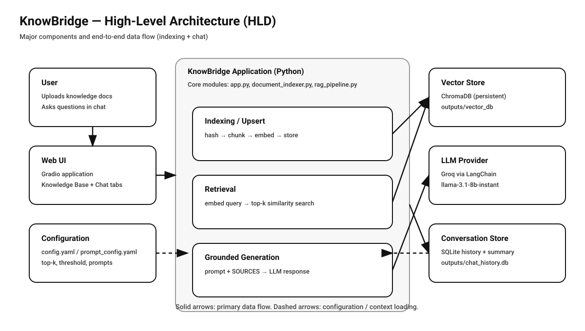

# KnowBridge — RAG-Powered Knowledge Assistant

*Transform your documents into an intelligent knowledge assistant.*


## 1. Introduction

### 1.1 Background and Motivation
Large Language Models (LLMs) can produce fluent answers, but in knowledge-work settings (PMO, HR, operations) **fluency is not enough**—answers must be traceable to internal documents such as onboarding checklists, offboarding procedures, and timesheet policies. Without grounding, an assistant may:

- Hallucinate steps that don’t exist in the organization’s process
- Mix policies across different clients/projects
- Provide confident but unverifiable guidance

This project implements a **Retrieval-Augmented Generation (RAG)** assistant called **KnowBridge** that answers user questions using **only the indexed internal documents** (currently `.md` and `.docx`). The system is designed to prioritize traceability and practical deployment: persistent storage, incremental re-indexing, and session-based chat history.

### 1.2 Problem Statement
General-purpose LLMs are not reliable when asked detailed procedural questions. They can:

- Invent missing details
- “Fill gaps” with assumptions
- Blend unrelated content

The core problem is the absence of **source-bounded reasoning**: the model must be forced to answer from retrieved context, not from prior training knowledge.

### 1.3 Objectives
- Build a document-grounded knowledge assistant
- Enforce retrieval-before-generation (RAG)
- Maintain traceability to source documents (by source name)
- Persist the vector index to avoid re-embedding on every run
- Support incremental indexing (skip unchanged docs, re-index only updated)
- Provide a usable UI for uploading knowledge base files and chatting
- Persist chat history per user/session and support long-running conversations

### 1.4 Scope
- **Document type:** Markdown (`.md`) and Word (`.docx`) knowledge files
- **Knowledge base:** multiple documents (e.g., onboarding, offboarding, timesheet)
- **Interaction:** Web UI (Gradio)
- **Storage:** persistent ChromaDB vector store + SQLite chat history
- **LLM provider:** Groq via LangChain

---

## 2. System Architecture

### 2.1 Architectural Overview
KnowBridge uses a modular pipeline that separates:

1. Document ingestion and indexing
2. Vector storage and semantic retrieval
3. Prompt construction and grounded generation
4. Conversation memory (persistence + summarization)
5. Web interface for uploads and chat

This separation makes the system maintainable and easy to extend.

### 2.2 High-Level Architecture (HLD)



### 2.3 Component Layers

**Data Layer**
- Knowledge base documents (Markdown `.md` and Word `.docx`).
- Included sample docs in `rag-knowledge-assistant/data/`:
  - `onboarding_alpha.md`
  - `offboarding_alpha.md`
  - `timesheet.md`

**Processing Layer**
- Incremental indexing with file hashing (SHA-256)
- Recursive character text splitting

**Embedding Layer**
- HuggingFace Sentence-Transformer embeddings:
  - `sentence-transformers/all-MiniLM-L6-v2`

**Storage Layer**
- ChromaDB persistent vector database (cosine space)

**Retrieval Layer**
- Semantic similarity search (top-k) with distance thresholding

**Generation Layer**
- Groq chat model via LangChain `ChatGroq`
- Grounding prompt enforces “documents-only” answers
- Response includes a strict `SOURCES:` line for traceability

**Memory Layer**
- SQLite persistence for chat history (per session)
- Rolling summarization of older messages to keep context compact
- Recent-window trimming for bounded prompt size

**Interface Layer**
- Gradio app with two tabs:
  - Knowledge Base (upload & index)
  - Chat (ask questions, persist sessions)

---

## 3. Methodology

### 3.1 Document Ingestion (Incremental Upsert)
Uploaded `.md` and `.docx` files are handled via an upsert strategy:

- **added**: new source → chunk + embed + store
- **updated**: source hash changed → delete old chunks, then re-index
- **unchanged**: source hash matches → skip embedding

The file hash is stored in Chroma metadata so it can be compared later.

### 3.2 Text Processing
Documents are processed as plain text. Each stored chunk is associated with:

- `source` (a source identifier derived from the uploaded filename; legacy `.md` sources are stored without an extension for backward compatibility)
- `file_hash` (SHA-256 of the full document content)

### 3.3 Chunking Strategy
Recursive character-based chunking using LangChain’s splitter:

- Chunk size: **1000 characters**
- Overlap: **200 characters**

This balances retrieval precision (smaller chunks) and context completeness (overlap).

### 3.4 Embedding Pipeline
Each chunk is embedded using:

- Sentence-transformer model: **`all-MiniLM-L6-v2`**

### 3.5 Vector Storage
Embeddings are stored in a persistent ChromaDB collection:

- Persistent directory: `rag-knowledge-assistant/outputs/vector_db/`
- Collection name: `knowledge_base`

Benefits:

- Stable, reusable index across runs
- Avoids unnecessary re-embedding
- Enables quick startup and interactive usage

### 3.6 Retrieval Process
At query time:

1. The user query is embedded using the same embedding model
2. ChromaDB returns top-k candidate chunks and their cosine distances
3. Results are filtered by a configurable distance threshold

Default retrieval parameters (configurable in YAML):

- `n_results`: **5**
- `threshold`: **0.5** (distance; lower means closer match)

**Fallback behavior:** If no chunks pass the threshold, the system returns the top-k results anyway (to avoid an empty context). This is paired with strict prompting to minimize hallucination.

### 3.7 Generation Control (Grounded Prompt)
The RAG assistant prompt enforces:

- Answer **only** from provided documents
- If not answerable: respond that it’s not answerable from the documents
- Never answer from the model’s own knowledge
- Always append a final line: `SOURCES: ...` (or `SOURCES: none`)

### 3.8 Conversation Memory
The assistant supports long-running conversations with bounded context:

- **SQLite persistence** stores every message per session
- **Trim window** keeps only the most recent messages for each request
- **Rolling summarization** condenses older parts of the conversation

This allows the assistant to remain aware of the conversation while keeping prompts manageable.

---

## 3.9 Pipelines (Diagrams)

### Document Ingestion and Vectorization Pipeline

```
+--------------------------+
|     Knowledge Files      |
+------------+-------------+
             |
             v
+--------------------------+
|  Upsert + Hash Checking  |
| (added/updated/unchanged)|
+------------+-------------+
             |
             v
+--------------------------+
|    Text Chunking         |
| (Recursive Splitter)     |
| size=1000, overlap=200   |
+------------+-------------+
             |
             v
+--------------------------+
| Sentence-Transformer     |
| all-MiniLM-L6-v2         |
+------------+-------------+
             |
             v
+--------------------------+
| Chroma Persistent Vector |
| DB (cosine / HNSW)       |
+--------------------------+
```

### Query + Memory Pipeline

```
+--------------------+
|      User Query    |
+---------+----------+
          |
          v
+-----------------------------+
| Load SQLite Session History |
| + Rolling Summary           |
+--------------+--------------+
               |
               v
+-----------------------------+
| Embed Query + Retrieve TopK |
| threshold filtering +       |
| fallback to topK if empty   |
+--------------+--------------+
               |
               v
+-----------------------------+
| Grounded Prompt Build       |
| (docs-only + SOURCES line)  |
+--------------+--------------+
               |
               v
+-----------------------------+
| Groq LLM (ChatGroq)         |
| model: llama-3.1-8b-instant |
+--------------+--------------+
               |
               v
+-----------------------------+
| Response + SOURCES          |
| Persist to SQLite           |
+-----------------------------+
```

---

## 4. Hallucination Control Framework

### 4.1 Prompt Constraints
The system prompt explicitly states:

- The assistant must answer using only the retrieved documents
- The assistant must refuse when not answerable from the provided documents
- The assistant must never rely on external knowledge

### 4.2 Retrieval Dependency
The generation prompt is constructed around “Relevant documents + User question”, making retrieval an explicit dependency for answering.

### 4.3 Source Traceability
Each retrieved chunk is prefixed with `[Source: <name>]`, and the model is required to append:

- `SOURCES: <comma-separated list>`

This provides transparent traceability to the document(s) used.

### 4.4 Safe Failure Behavior
The intended safe behavior for out-of-scope questions is a refusal:

- “The question is not answerable given the documents”

In addition, the retriever has a practical fallback (return top-k results even if none pass the threshold) to avoid empty-context generation. In practice, threshold tuning is important to balance recall vs. relevance.

---

## 5. Implementation Details

### 5.1 Technology Stack
- Python
- LangChain
- Groq LLM API (`langchain_groq`)
- ChromaDB (persistent vector store)
- HuggingFace embeddings (`langchain_huggingface`, `sentence-transformers`)
- Gradio (web UI)
- SQLite (chat history + summaries)
- `python-docx` (Word `.docx` text extraction)
- `python-dotenv`, `pyyaml`

### 5.2 Key Modules
- `code/app.py`: Gradio UI (upload/index + chat)
- `code/document_indexer.py`: chunking, embeddings, Chroma persistence, incremental upsert
- `code/rag_pipeline.py`: retrieval, prompt construction, LLM invocation, summarization
- `code/chat_history_db.py`: SQLite-backed history + rolling summaries
- `code/config/config.yaml`: model + vector DB parameters
- `code/config/prompt_config.yaml`: grounding prompt rules (including `SOURCES:`)

### 5.3 Configuration Parameters
- LLM model: `llama-3.1-8b-instant`
- Retrieval: `n_results=5`, `threshold=0.5` (distance)
- Memory: `trimming_window_size=6` messages in the prompt window

---

## 6. Limitations
- Grounding is enforced via prompting (not a cryptographic guarantee)
- Fallback-to-topK can include weakly related chunks if threshold is too strict
- No reranking model (e.g., cross-encoder) to refine retrieved results
- No formal evaluation metrics or benchmark suite included
- No native PDF ingestion in this project
- Legacy Word `.doc` (non-`.docx`) is not supported
- `.docx` extraction is best-effort plain-text (formatting, images, and complex layouts are not preserved)

---

## 7. Future Work
- Add strict “I don’t know / not answerable” fallback when retrieval confidence is low
- Add optional deterministic generation (e.g., `temperature=0`) for higher stability
- Add a reranker to improve precision on close or ambiguous queries
- Add chunk-to-document citations (e.g., snippet IDs / offsets) for stronger traceability
- Expand ingestion to PDF with robust parsing and normalization
- Improve `.docx` parsing/normalization (headers/footers, lists, section structure)
- Add automated evaluation (gold Q/A pairs + retrieval metrics)

---

## 8. Conclusion
KnowBridge demonstrates a practical, modular RAG architecture for correctness-sensitive internal knowledge work. By combining persistent vector search, strict grounding prompts, incremental indexing, and session-based memory persistence, the assistant can answer operational questions in a way that is more traceable and controllable than a general-purpose LLM alone.
